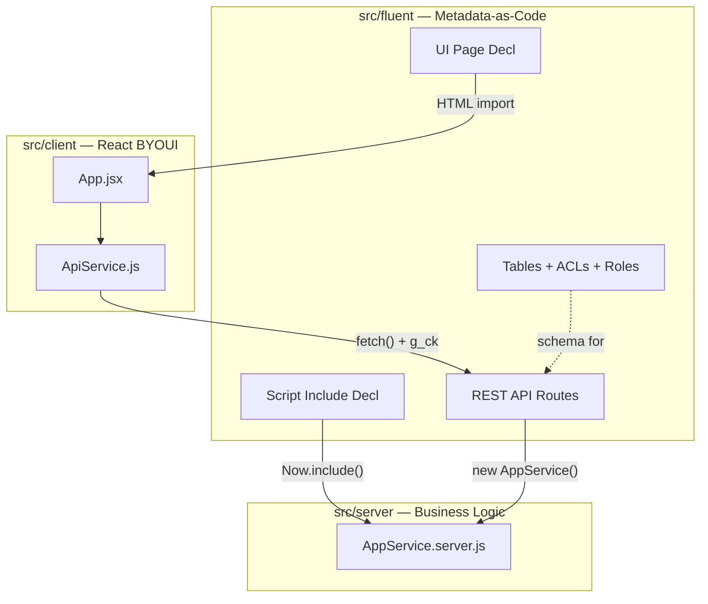

<!-- template: servicenow-scoped-app | sdk: @servicenow/sdk@4.4.0 | scope-prefix: x_snc_example | layers: fluent|server|client | deploy: now-sdk install -->

<p align="center">
  
</p>

<h1 align="center">ServiceNow App Template</h1>

<p align="center">
  <a href="https://img.shields.io/badge/ServiceNow_SDK-4.4.0-005E4D"></a>
  <a href="https://img.shields.io/badge/React-18.2-00A893"></a>
  <a href="LICENSE"></a>
  <a href="https://claude.com/claude-code"></a>
</p>

<p align="center">
  AI-assisted development template for ServiceNow scoped apps.<br>
  <strong>Claude Code + now-sdk</strong> — one command deploys everything.
</p>

---

## Patterns Included

`CSRF Protection` · `Cross-Scope Privileges` · `Now.include() Bundling` · `BYOUI React Pages` · `Role-Based ACLs` · `Seed Data` · `Scripted REST API` · `Business Rules` · `Application Menu` · `Scope Prefix Helpers`

## Quick Start

1. Click **"Use this template"** on GitHub to create your repo
2. Clone and configure:
```bash
git clone https://github.com/YOUR_USERNAME/your-app.git
cd your-app
cp .env.example .env              # Fill in instance credentials
cp .mcp.json.example .mcp.json    # Configure MCP for Claude Code
npm install
```
3. Set up instance auth:
```bash
now-sdk auth --add YOUR_INSTANCE --type basic
```
4. Update `now.config.json` with your instance's scopeId (sys_id from sys_app record)
5. Build and deploy:
```bash
npm run build
now-sdk install --auth YOUR_ALIAS
```
6. Open `https://YOUR_INSTANCE.service-now.com/x_snc_example_app.do`

## What Gets Deployed

| Component | Count | Description |
|-----------|-------|-------------|
| Table | 1 | Example Item (5 columns) |
| Script Include | 1 | AppService (CRUD operations) |
| REST API | 4 routes | List, Create, Update, Delete |
| BYOUI Page | 1 | React app with CRUD UI |
| ACLs | 4 | Read, Write, Create, Delete |
| Roles | 2 | admin, user |
| Business Rule | 1 | Default category |
| Cross-scope privileges | 4 | Prevents REST 403 |
| Seed records | 3 | Sample items |

## Architecture

Three source layers, one deploy command:



## Development with Claude Code

This template includes a comprehensive `CLAUDE.md` that teaches Claude Code how to:
- Add new tables with proper ACLs and cross-scope privileges
- Add Script Includes with the `Now.include()` pattern
- Add BYOUI React pages with `fetch()` + `g_ck` CSRF protection
- Add REST API endpoints
- Handle secrets with `password2` properties

Start Claude Code in this directory and ask it to extend the app.

> **Other AI tools:** A `.github/copilot-instructions.md` is included with the critical patterns for GitHub Copilot and other AI coding assistants.

## Customizing the Scope

Change the scope prefix from `x_snc_example` to your app name:
```bash
./set-scope.sh x_XXXX_myapp
```
This updates all table names, field names, API paths, and file references across the project.

## Connect ServiceNow IDE (optional)

After deploying via now-sdk, connect the IDE for browser-based editing and Build Agent access:

1. Open `https://YOUR_INSTANCE.service-now.com/sn_glider_app/ide`
2. Click **Create Workspace** → name it (e.g., "Example App")
3. Click **Clone Git Repository**
4. Enter: `https://github.com/YOUR_USERNAME/your-app.git` + GitHub PAT
5. The IDE connects to the already-deployed app — no conflicts

The workspace gives you: file editing in the browser, Build Agent (10 prompts/month on PDI), and IDE git integration for pushing changes back to GitHub.

## Project Structure

```
src/
├── client/                    # BYOUI React pages
│   ├── index.html             # Entry point with <sdk:now-ux-globals>
│   ├── app.jsx                # React entry
│   ├── components/App.jsx     # CRUD component
│   └── services/ApiService.js # fetch() REST client
├── server/                    # Script Includes
│   └── AppService.server.js   # Business logic
└── fluent/                    # SDK Fluent metadata
    ├── tables/                # Table definitions
    ├── acls/                  # Access controls
    ├── roles/                 # Role definitions
    ├── script-includes/       # SI declarations (Now.include pattern)
    ├── rest-api/              # Scripted REST endpoints
    ├── privileges/            # Cross-scope privileges
    ├── ui-pages/              # UiPage with direct:true
    ├── business-rules/        # Before/after rules
    ├── navigation/            # App menu
    ├── records/               # Seed data (Record API)
    └── index.now.ts           # Barrel exports
```

## Troubleshooting

See [TROUBLESHOOTING.md](TROUBLESHOOTING.md) for common issues (REST 403, blank BYOUI pages, CSRF errors).

## Related Projects

- **[mcp-server-servicenow](https://github.com/jschuller/mcp-server-servicenow)** — MCP server with 18 tools for ServiceNow table, CMDB, system, and update set operations. Pairs with this template for AI-assisted development.
- **[project-virgil](https://github.com/leojacinto/project-virgil)** — Interesting now-sdk example patterns.
- **[ServiceNow SDK Examples](https://github.com/ServiceNow/sdk-examples)** — Official SDK samples from ServiceNow.

## Built With

- [ServiceNow SDK (Fluent)](https://www.servicenow.com/docs/r/yokohama/application-development/servicenow-sdk/servicenow-fluent-api-reference.html) · [React 18](https://react.dev) · [Claude Code](https://claude.com/claude-code)

## Contributing

See [CONTRIBUTING.md](CONTRIBUTING.md).

## License

[MIT](LICENSE)
